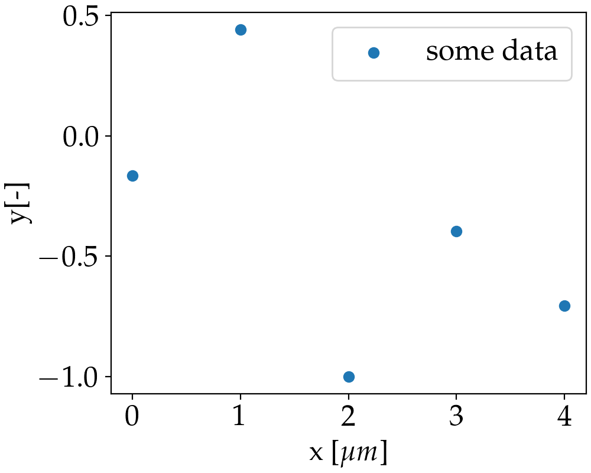

# Applied Optics python plots
Minimial code to produce plots in matplotlib that preserve the looks of Applied Optics.

Code in example_plot.py generates the following image, which makes use of the font used in the AO template.

